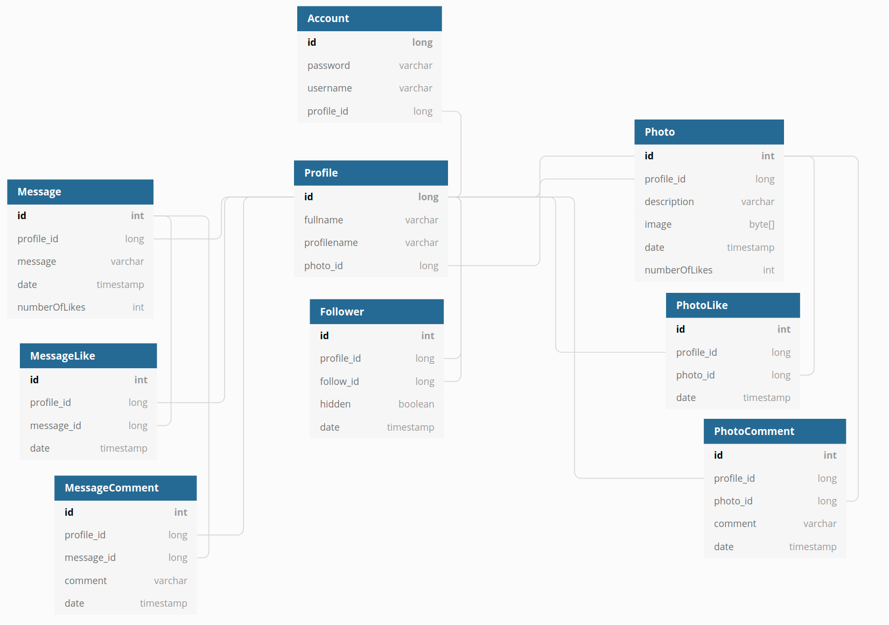

# wepa-projekti
Web-palvelinohjelmointi Java, 2021 -projektityö (Lauri Vuorenkoski)

Toteutuskielet: Java ja Javascript (Spring framework, Thymeleaf, Bootstrap). Data liikkuu selaimen ja palvelimen välillä restin läpi, lukuunottamatta kirjautumista ja profiilin tietoja. Pääosin single-page application.

[Tehtäväksianto](https://web-palvelinohjelmointi-21.mooc.fi/projekti)

## Heroku

[Sovellus herokussa](https://hidden-tundra-44605.herokuapp.com/)

## Issues

- selenium ei tunnista javascriptin metodia document.prepend. Vaihtaminen chrome-driveriin auttaisi? Selenium tulostaa virheilmoituksia mutta testit menevät kyllä läpi

## Test and run

Testing
```
mvn test
```

Running
```
mvn compile exec:java -Dserver.port=8080 -Dexec.mainClass=projekti.MyApplication
```


## Käyttöohjeet

### Rekisteröityminen ja kirjautuminen sisään

Käyttääkseksi palvelua sinun tulee ensin kirjautua sisään. Tämä tapahtuu painamalla 'rekisteröidy' etusivulla. Rekisteröitymisessä sinun tulee luoda käyttäjätunnus (jota ei ole jo käytössä) sekä salasana. 

Rekisteröitymisen jälkeen sinut ohjataan kirjautumissivulle, jonne tulee syöttää juuri luodut tunnukset. Onnistuneen kirjautumisen jälkeen sinut ohjataan sivulle jossa sinultä kysytään nimesi ja profiilin nimi. Profiilinimi näkyy käyttäjän sivun osoitteessa. Profiilin nimessä tulee olla ävhintään viisi merkkiä (a-z).

### Viestien lähettäminen

Kirjautumisen jälkeen pääset pääsivulle. Voit julkaista viestin kirjoittamalla sne tekstikenttään ja painamalla 'Julkaisu uusi viesti' nappia.

Näkymässä näkyy omat viestisi ja niiden käyttäjien viestit joita seuraat (25 uusinta). 

Voit tykätä viestistä painamalla 'Tykkää' nappia. Voit tykätä viestistä vain kerran. Tykkäystä ei voi poistaa. Voit myös kommentoida omaa tai seurattavien käyttäjien viestejä kijroittamalla kommentin ja painamlla 'lähetä kommentti' nappia.

### Kuvien lisääminen

Painamlla valikon tekstiä 'Kuva-albumi' pääset näkymään jossa voit selata omia kuvia sekä niiden käyttäjien kuvia joita seuraat. Kuva lähetetään painamalla ensin 'Valitse tiedosto' nappia. Avautuvasta ikkunasta valitse jpg muotoinen kuva tietokoneeltasi. Tämän jälkeen kirjoita kuvan kuvaus tekstikenttään (pakollinen). Lopuksi paina 'Julkaise uusi kuva'.

Albummiisi mahtuu vain 10 kuvaa. Voit poistaa kuvia painamalla kuvan kohdalla 'Poista' nappia. Voit asettaa kuvasi profiilikuvaksi painamalla 'Aseta profiilikuvaksi'. Profiilikuvaa ei voi poistaa. Sinun tulee ensi valita jokin muu kuva profiilikuvaksi ja poistaa kuva vasta sen jälkeen.

Kuvista voi tykätä ja niitä voi kommentoida samalla tavalla kuin viestejä.

### Käyttäjien seuraaminen

Painamalla valikon tekstiä 'Seuraaminen' pääset näkymään jossa voit lisätä ja poistaa seurattavia käyttäjiä. Voit myös tarkastella ketkä seuraavat sinua ja tarvittaessa voi estää heitä seuraamasta (estetyt seuraajat eivät näe viestejäsi tai kuviasi).

Käyttäjän lisääminen tapahtuu siten, että ensin haet käyttääjää nimellä tai nimen osalla. Hakusana kirjoitetaan tekstikenttään 'käyttäjän nimi'. Paina tämän jälkeen 'Hae seurattavia' nappia. Tämän jälkeen näet listan käyttäjistä jotka vastaavat hakukriteeriä. Voit lisätä käyttäjän seurattavaksi painamalla 'lisää' tekstiä.

Voit myös poistaa käyttäjiä seurannasta. Käyttäjät joita seuraat on listattu sivulla. Painamalla 'poista' tekstiä nimen perässä käyttäjä poistuu seurannasta.

Sivulla näkyy myös käyttäjät jotka seuraavat sinua. Voit estää käyttäjää seuraamasta painamalla 'estä' tekstiä nimen lopussa. Yliviivattu nimi on estetty. Voit mys poistaa eston painamalla 'poista esto'.

### Asetukset

Asetukset välilehdellä voit painaa muuta profiilin tietoja tekstiä. Tästä avautuu ikkuna jossa voit muuttaa nimeäsi ja profiilin nimeä. Välilehdeltä löytyy myös linkki ohjeisiin.

## Tietokantarakenne



## Rajapinnan tiivis kuvaus

### Data liikkuu json muodossa

#### POST: "/api/messages"

Uuden viestin lähettäminen. payload: {message: "viesti"}

#### GET: "/api/messages"
Viestien hakeminen. Palauttaa kaikki käyttäjän ja seurattavien viestit.

#### POST: "/api/messages/{id}/comments"
Kommentin lähettäminen. id=viestin id. payload: {comment: "kommentti"}

#### POST: "/api/messages/{id}/likes"
Tykkäyksen lähettäminen. id=viestin id.

#### GET: "/api/photos"
Kuvien tietojen hakeminen. Palauttaa kaikki käyttäjän ja seurattavien kuvat.

#### GET: "/api/photos/{id}"
Yksittäinen kuva jpg muodossa.

#### DELETE: "/api/photos/{id}"
Kuvan poistaminen. Id=kuvan id.

#### POST: "/api/photos/{id}/comments"
Kommentin lähettäminen. id=kuvan id. Payload: {comment: "kommentti"}

#### POST: "/api/photos/{id}/likes"
Tykkäyksen lähettäminen. id=kuvan id.

#### POST: "/api/follow/{id}"
Käyttäjän seuraamisen aloittaminen. id=seurattavan profiilin id.

#### GET: "/api/follow"
Haet profiilit joita käyttäjä seuraa.

#### DELETE: "/api/follow/{id}"
Poista toisen käyttäjä profiilin seuraaminen. id=seuraamisen id

#### GET: "/api/followers"
Hae profiilit jotka seuraavat käyttäjää

#### POST: "/api/follower/{id}/hide"
Piilota oman profiilin näkyminen seuraajalta. id=seuraamisen id

#### POST: "/api/follower/{id}/unhide"
Palauta oman profiilin näkyminen seuraajalta. id=seuraamisen id

#### GET: "/api/profiles?name={merkkijono}"
Käyttäjäprofiilien haku. Get parametrina name voi antaa hakumerkkijonon.

#### POST: "/profile/photo?id={id}"
Kuva asetetaan propfiilikuvaksi. id=kuvan id.

### Data lähetetään html formilla

#### POST: "/api/photos"
Kuvan lähettäminen. post-parametrit image ja description. multipart/form-data 

#### POST: "/signup"
rekisteröityminen. post-parametrit username ja password.

#### POST: "/profile"
Profiilin muokkaaminen. post-parametrit fullname ja profilename.

#### POST: "login"
Kirjautuminen. post-parametrit username ja password.
